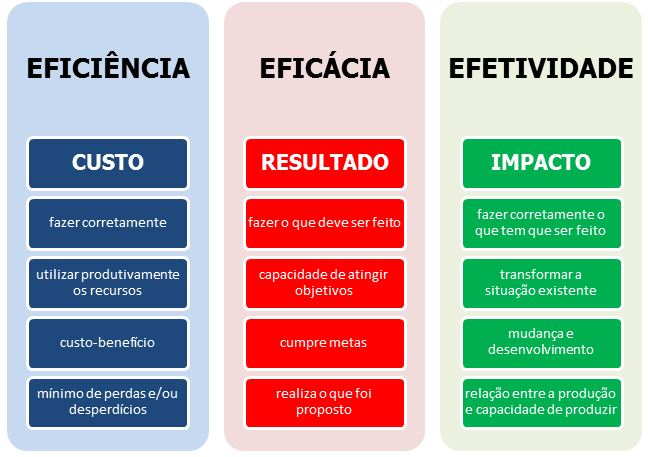

# ADMINISTRAO
Repositório contendo conteúdos das cadeiras de ADM

Eficiência x Eficácia x Efetividade

Eficiência: é quando algo é realizado da melhor maneira possível, ou seja, com menos desperdício ou em menor tempo.

Eficácia: é quando um projeto/produto/pessoa atinge o objetivo ou a meta.

Efetividade: é a capacidade de fazer uma coisa (eficácia) da melhor maneira possível (eficiência).

FONTE: https://www.tecconcursos.com.br/blog/eficiencia-eficacia-e-efetividade-material-teorico/#:~:text=Efici%C3%AAncia%3A%20%C3%A9%20quando%20algo%20%C3%A9,melhor%20maneira%20poss%C3%ADvel%20(efici%C3%AAncia).
